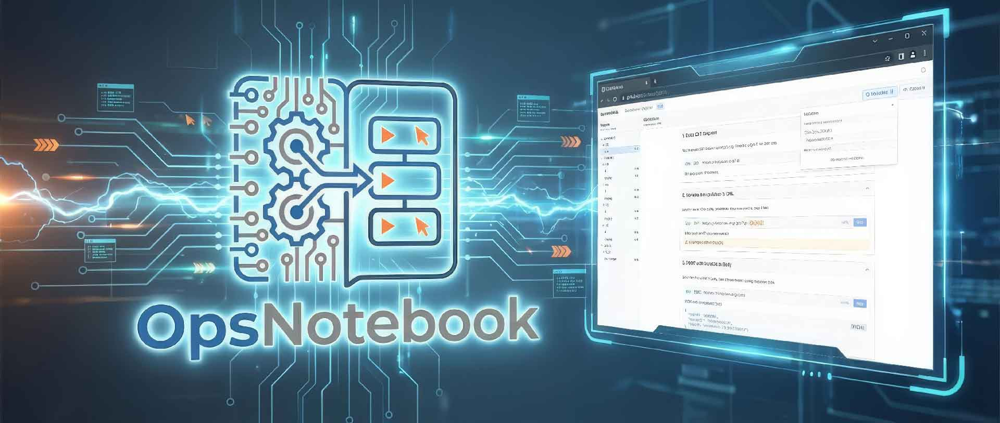
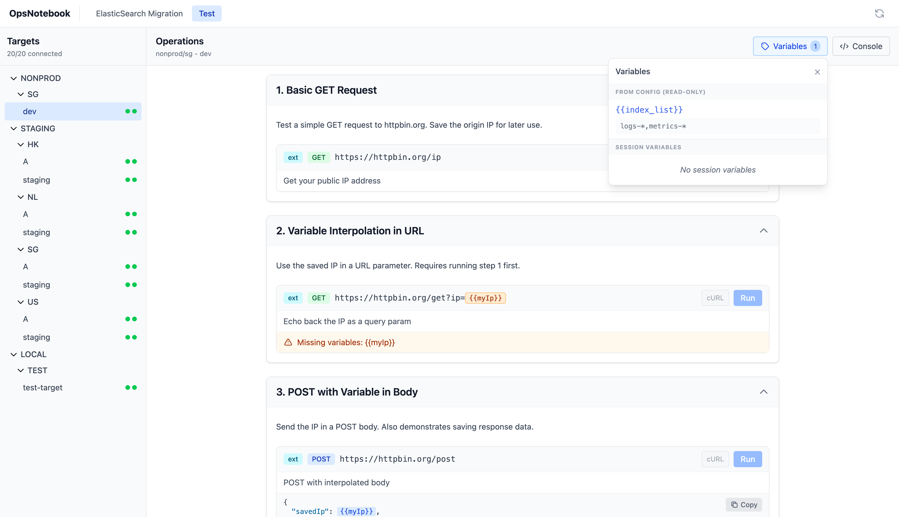

# OpsNotebook





OpsNotebook is a generic, extensible Operations Platform designed to manage connections to remote systems and execute "Notebooks" (interactive workflows) against them.

## 🚀 Features

- **Technology Agnostic:** Can connect to ElasticSearch, PostgreSQL, Redis, Kubernetes, or any system reachable via a CLI command.
- **External Driver Protocol:** Delegates connection logic (auth, tunnels, port-forwarding) to external drivers (Python, Bash, etc.).
- **Interactive Notebooks:** React-based UI for executing sequential operations, visualizing results, and piping data between steps.
- **Flexible Grouping:** Group targets arbitrarily (e.g., "Primary/Replica", "Prod/Staging/Dev", "Blue/Green") using tags. No longer limited to pairs.
- **Label-Based Filtering:** Use Kubernetes-style label selectors to filter which targets appear in specific notebooks.
- **Notebook-Specific Target Colors:** Customize target colors per notebook for better visual organization.
- **Configurable Visuals:** Assign distinct colors to targets to prevent "wrong cluster" mistakes.
- **Direct Tunnel Access:** Generates cURL commands that bypass the proxy for direct terminal access.

## 📦 Architecture

- **Backend (Go):** A lightweight process manager. It spawns drivers, talks to them over a local HTTP control plane, and acts as an HTTP proxy.
- **Frontend (React):** A notebook interface. It groups targets based on tags and sends requests to the backend proxy.
- **Drivers (Python/Bash):** The "brains" of the connection. They handle `kubectl port-forward`, SSH tunnels, or database auth.

## 🛠️ Quick Start

### Prerequisites

- Go 1.22+
- Node.js 18+
- Python 3 (for the default ES driver)

### Running

```bash
# Start the full stack
./run.sh
```

Access the UI at `http://localhost:12807`.

## 📚 Documentation

- [Core Architecture](docs/CORE_ARCHITECTURE.md)
- [Driver Protocol](docs/DRIVER_PROTOCOL.md)
- [Notebooks](docs/NOTEBOOKS.md)
- [Contributing](CONTRIBUTING.md)
